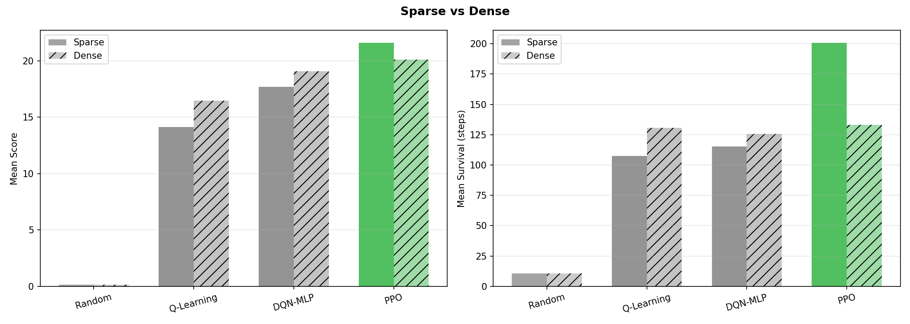
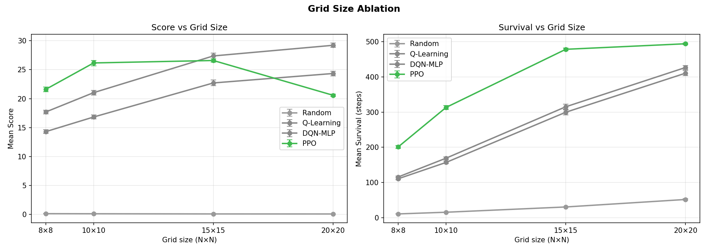
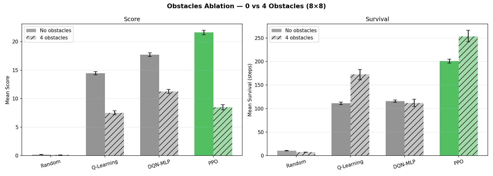

# Benchmarking Q-Learning, DQN-MLP, and PPO on the Snake Game
### Final Project — Reinforcement Learning and Decision Making Under Uncertainty

This repository contains the implementation and results of a project conducted as part of the course **Reinforcement Learning and Decision Making Under Uncertainty** by Prof. Christos Dimitrakakis, within the [Swiss Joint Master in Computer Science](https://mcs.unibnf.ch/).

The project was carried out by :  
**Allizha Theiventhiram** — University of Neuchâtel — allizha.theiventhiram@unine.ch  
**Boris Verdecia Echarte** — University of Neuchâtel — boris.verdecia@unine.ch

---

## Overview

This project compares three reinforcement learning algorithms on the Snake game, modelled as a Markov Decision Process. We test how performance changes when we vary the **reward function** (sparse vs. dense), the **grid size** (8×8 to 20×20), and the **environment difficulty** (with and without obstacles).

| Algorithm | Type | Training budget | Mean Score (8×8, sparse) |
|-----------|------|----------------|--------------------------|
| Random | Baseline | — | 0.15 |
| Q-Learning | Tabular | 10k episodes | 14.12 |
| DQN-MLP | Deep RL | 10k episodes | 17.69 |
| PPO | Policy gradient | 500k steps | **21.61** |

Key findings:
- PPO is the best algorithm on the base setting but degrades on larger grids
- Dense reward helps Q-Learning and DQN-MLP but unexpectedly hurts PPO
- Q-Learning and DQN-MLP generalise better to unseen grid sizes
- DQN-MLP is the most robust algorithm when obstacles are introduced

---

## Project Structure

```
RL-project/
│
├── game_env/
│   ├── snake_game.py           # Snake game logic + Gymnasium wrapper
│   └── snake_w_obstacles.py    # Obstacle variant (random placement)
│
├── q_learning/
│   ├── q_learning.py           # Q-Learning training + evaluation
│   ├── q_learning_model_10k_sparse.pkl
│   └── q_learning_model_10k_dense.pkl
│
├── dqn/
│   └── dqn.py                  # DQN-MLP inference
│
├── ppo/
│   ├── ppo.py                  # PPO training + evaluation
│   ├── ppo_snake_model_sparse.zip
│   └── ppo_snake_model_dense.zip
│
├── results/
│   └── final/                  # Evaluation plots + JSON results
│
├── eval.py                     # Unified evaluation script (all experiments)
├── dqn.ipynb                   # DQN-MLP training notebook
├── snake_dql_sparse_10k.pt     # Trained DQN-MLP sparse weights
├── snake_dql_dense_10k.pt      # Trained DQN-MLP dense weights
└── pyproject.toml
```

---

## Installation

```bash
git clone https://github.com/veborito/RL-project
cd RL-project
pip install gymnasium stable-baselines3 torch pygame tqdm matplotlib scipy
```

Or with `uv`:
```bash
uv sync
```

---

## MDP Formulation

| Component | Description |
|-----------|-------------|
| **State S** | 11 binary features: danger ×3, heading ×4, food direction ×4 |
| **Actions A** | UP, DOWN, LEFT, RIGHT |
| **Reward (sparse)** | +10 eat food · −10 die · 0 otherwise |
| **Reward (dense)** | +10 eat · −10 die · ±0.1/−0.15 distance shaping · −0.1/step |
| **Discount γ** | 0.99 |

The 11-feature state has only **2,048 possible values**, making Q-Learning tractable while still being expressive enough for DQN and PPO.

---

## Reproducing the Results

All experiments can be reproduced with a single script from the repo root.

### Run all experiments
```bash
python eval.py --mode all --episodes 100
```

### Run individual experiments
```bash
# Sparse vs dense reward comparison
python eval.py --mode comparison --episodes 100

# Grid size ablation (8×8, 10×10, 15×15, 20×20)
python eval.py --mode grid --episodes 100

# Obstacles ablation (0 vs 4 obstacles)
python eval.py --mode obstacles --episodes 100
```

Results are saved to `results/final/` as JSON files and PNG plots.

### Evaluation details
- **5 seeds**: `{42, 123, 456, 789, 999}` — same for all algorithms
- **100 episodes per seed** = 500 total evaluation episodes per condition
- **Greedy mode**: no exploration during evaluation
- **Max 500 steps** per episode to prevent infinite loops
- **Bootstrapped 95% CI** (1,000 resamples) on all metrics

---

## Training from Scratch

```bash
# Q-Learning (sparse)
python -m q_learning.q_learning  # edit is_training=True in script

# DQN-MLP — use dqn.ipynb notebook

# PPO (sparse, 500k steps)
python ppo/ppo.py train --timesteps 500000 --grid 8

# PPO (dense)
python ppo/ppo.py train --timesteps 500000 --grid 8 --living-cost
```

---

## Results

### Sparse vs Dense Reward (8×8)



### Grid Size Ablation



### Obstacles Ablation



---

## Sources

| Component | Source |
|-----------|--------|
| Base game & environment | [johnnycode8/rl_snake](https://github.com/johnnycode8/rl_snake) |
| PPO training reference | [johnnycode8/rl_snake/train_snake.py](https://github.com/johnnycode8/rl_snake/blob/master/train_snake.py) |
| Q-Learning reference | [Gymnasium documentation](https://gymnasium.farama.org/introduction/train_agent/) |
| DQN reference | [olethrosdc/rldmuu lab8](https://github.com/olethrosdc/rldmuu/blob/main/src/labs/lab8.ipynb) |

---

## AI Tools

[Claude](https://www.anthropic.com/claude) (Anthropic) was used to assist with code structure, debugging, and the evaluation pipeline. [Gemini](https://gemini.google.com) (Google DeepMind) was used for the colour palette encoding of grid states. All generated code was reviewed and validated by the authors.

---

*Course: Reinforcement Learning and Decision Making Under Uncertainty — Prof. Christos Dimitrakakis*
